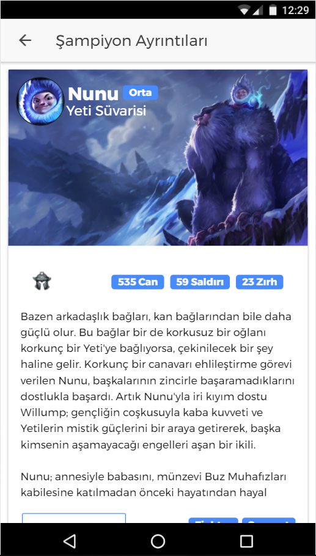
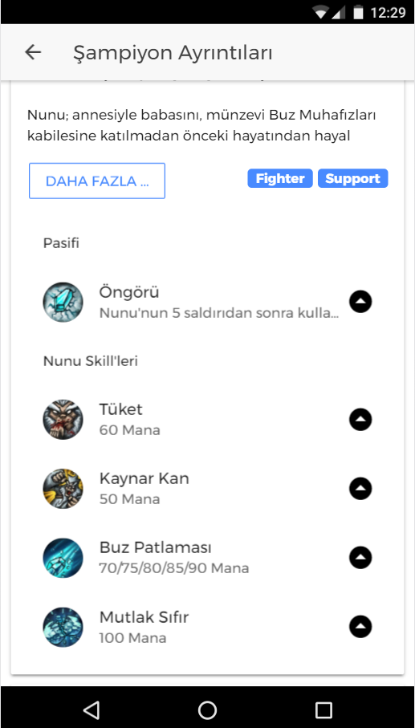
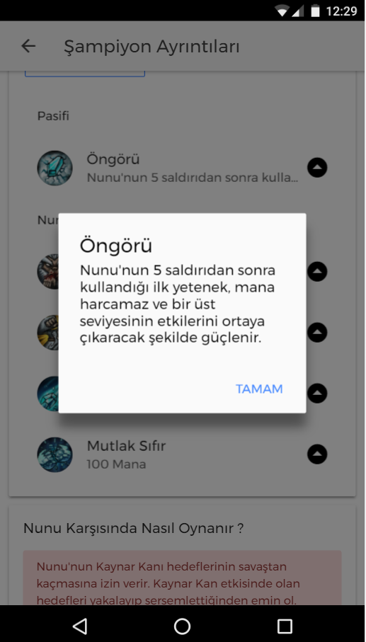
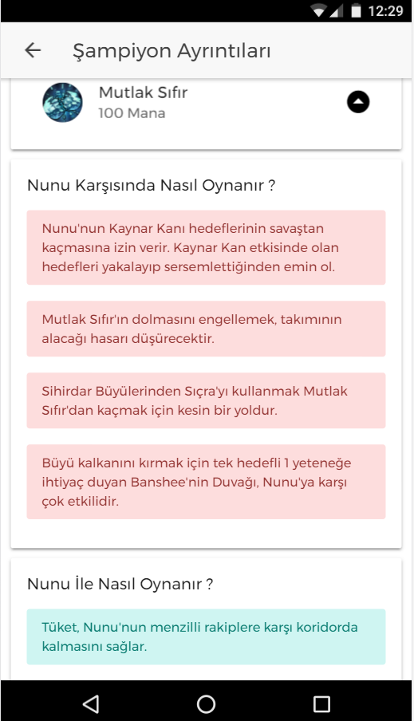
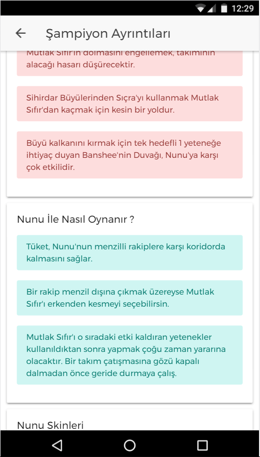
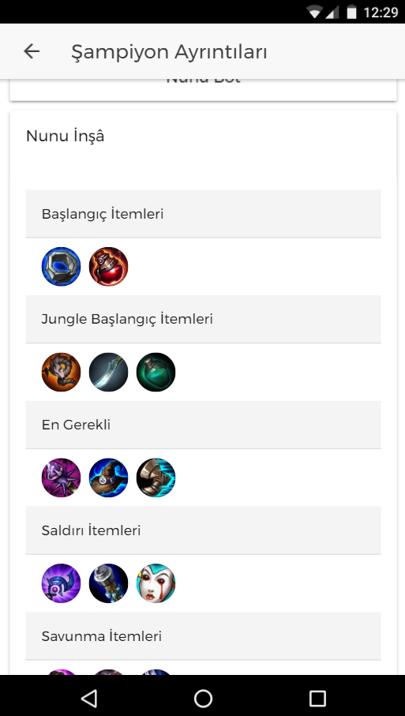

# GuidesOfLegends
Hello, I am developing a ionic app for my self. here is my completed.
that app use chamions and summoner api for android , ios and windows phone.
* the first think is a this is app has turkhis language.english is coming soon.
* İt's Champion List My app. Every champ has difficulty. and ı write how much easy that champ. ı write it just look.
* We can do it search by champ_name.
 *  
 * When ı click the champs on the list its coming :) 
 * And Here we Have description the champ and images.Of course His story too.([champname].lore)
 
 * And Here We have the Champs Skill. and skills how much need mana.
 
 * if we Click the Skill native alert is coming skills name and description and what the do.
 
 * Here The Tips 
 * Red one is against yellow one is ally.
 
 
 * Here is champ skins in the slider. we click we can download the image.
 
 * Here is some items in the tips for gamers.
 
 
 
 
 
 
 
 
